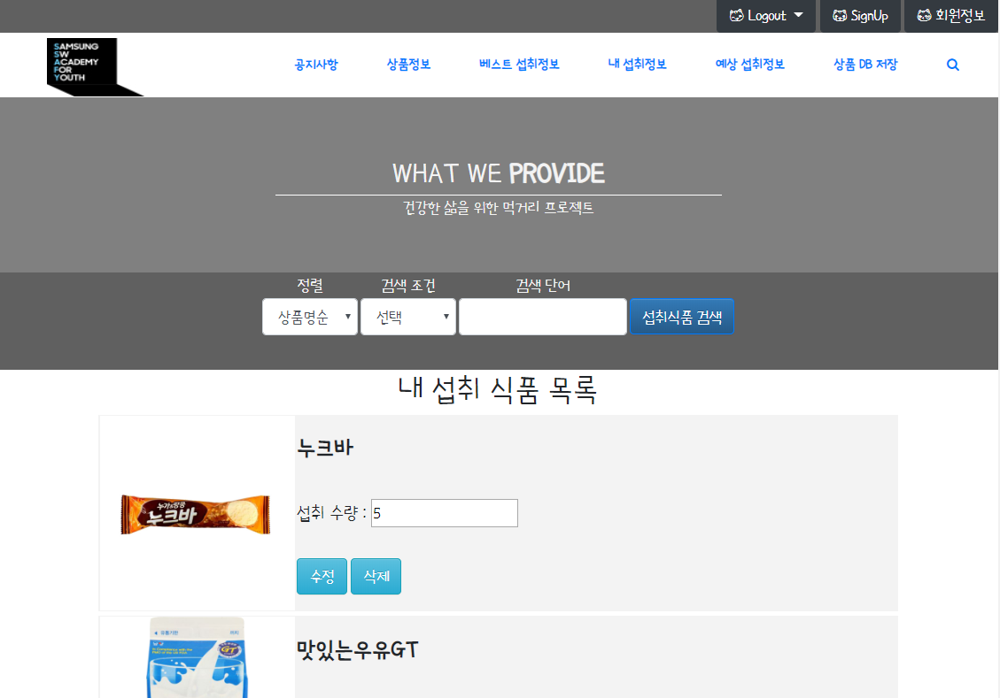

# 191109 관통 프로젝트(서유리, 이승순)

## 구현 기능  

### 기본  
1. 식품 정보 관리  
	- 메인페이지  
	  
	- 식품명 검색  
	  
	- 식품 목록 검색  
	  
	- 식품 상세 검색  
	  
     
2. 회원 관리(로그인/로그아웃)  
	- 회원 정보 등록, 수정, 삭제, 검색  
	  
	  
	- 로그인/로그아웃  
	  

### 추가  
1. 섭취식품 CRUD 또는 추가기능  
	- 섭취 식품 등록, 수정, 삭제, 검색  
	  
	  
	  

### 심화
1. 알레르기 성분 관리  
	- 회원의 알레르기 성분을 가진 재료 유무에 따른 붉은 글씨 표기  
	  

### 기타  
1. 회원 관리  
	- 회원 아이디 찾기  
	  
	- 회원 비밀번호 찾기  
	  
	- 로그인/아웃에 따른 로그인 화면 변경  
	 
	  
	- 로그인/아웃에 따른 메뉴 변경
	   
	  
2. 상품 관리
	- 상품 정렬 기능  
	  
	- 섭취 식품 검색, 정렬 기능  
	  
	
	
### Vue

1. QnA 게시판 관리
	- 게시글 목록 
	  
	- 게시글 등록
	  
	- 게시글 수정, 삭제
	  
	- 게시글상세 검색
	  

